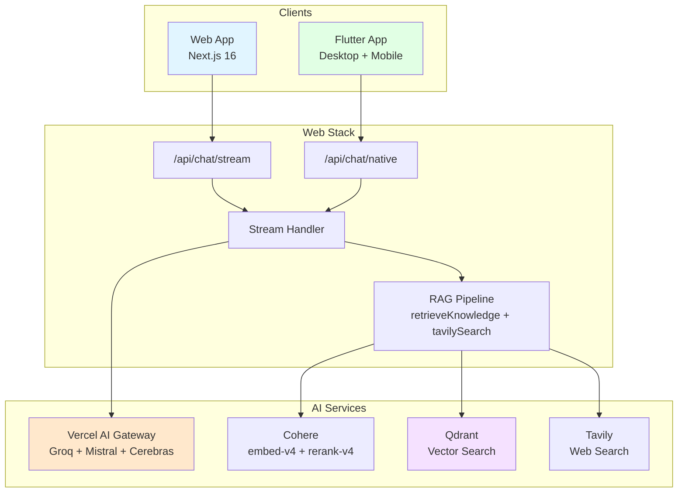

# otherdev-v2

> Digital platforms for pioneering creatives

[](https://vercel.com/new/clone?repository-url=https://github.com/kabeer11000/otherdev.web-02)
[](https://nextjs.org)
[](https://flutter.dev)
[](https://typescriptlang.org)

Monorepo containing multiple web applications built by [otherdev](https://otherdev.com) — a full-service web development and design studio based in Karachi City.

---

## System Architecture



---

## Projects

| Project | Description | Stack |
|---------|-------------|-------|
| [`web/`](web/README.md) | Main portfolio website (production) | Next.js 16 · React 19 · Tailwind CSS 4 |
| [`flutter_app/`](flutter_app/README.md) | Desktop (macOS/Win/Linux) + mobile companion | Flutter 3 · Riverpod · GoRouter |

### [`web/`](web/README.md) — Main Portfolio Website

**Start:** `cd web && bun install && bun dev`

- ~17 portfolio projects (fashion, design, enterprise)
- AI chat assistant with **Cohere RAG** (embed-v4 + rerank-v4 via Vercel AI Gateway)
- **Streamdown** progressive markdown with blurIn animation, Shiki code, KaTeX math, Mermaid diagrams
- **Inline bubble editing** — click pencil → textarea → Enter regenerates AI response
- **Branch navigation** — `<`/`>` to switch between edited message versions
- Radix UI + Tailwind CSS component system
- SEO-optimized with OG images and structured data

### [`flutter_app/`](flutter_app/README.md) — Flutter Companion App

**Start:** `cd flutter_app && flutter pub get && flutter run`

- Native desktop (macOS, Windows, Linux) + mobile via SSE to `/api/chat/native`
- Shared chat UI with web via `flutter_riverpod` state management
- `window_manager` + `tray_manager` + `hotkey_manager` for desktop polish
- `connectivity_plus` for offline detection
- `hive` + `flutter_secure_storage` for local persistence

---

## Quick Start

```bash
# Install all dependencies
bun install

# Run web app (Next.js)
cd web && bun dev

# Run Flutter app
cd flutter_app && flutter run
```

---

## Tech Stack

| Layer | Technologies |
|-------|--------------|
| Web Framework | Next.js 16.2.1 (App Router), React 19.2.4 |
| Web Language | TypeScript 5.9, CSS (Tailwind CSS 4) |
| Web AI | Vercel AI SDK, Vercel AI Gateway, Groq, Mistral |
| Flutter | Flutter 3, Riverpod 3, GoRouter 14, Dio |
| Embeddings | Cohere embed-v4.0 via AI Gateway |
| Vector Search | Qdrant (1536-dim, cosine similarity) |
| Cache / Rate Limit | Upstash Redis |
| RAG Search | Tavily (web search via `tavilySearch` tool) |
| Code Highlighting | Shiki (github-light / github-dark themes) |
| Progressive Markdown | Streamdown (blurIn animation, code/math/mermaid plugins) |
| Infrastructure | Vercel (Fluid Compute) |
| Email | Nodemailer, Google APIs (Sheets + Gmail) |

---

## Repository Structure

```
otherdev-v2/
├── web/                    # Next.js portfolio (main production)
│   ├── src/
│   │   ├── app/           # App Router pages + API routes
│   │   │   └── api/
│   │   │       ├── chat/stream/   # Streaming chat (web useChat)
│   │   │       └── chat/native/   # SSE endpoint (Flutter)
│   │   ├── components/   # React components + UI primitives
│   │   └── server/lib/   # Server utilities (RAG, rate limit, chat)
│   └── docs/             # Detailed web app documentation
├── flutter_app/           # Flutter desktop + mobile companion
│   └── lib/              # ChatRepository, SSE client, Riverpod providers
├── docs/                  # Shared project documentation
└── CLAUDE.md             # Claude Code guidance
```

---

## Documentation

| Doc | Description |
|-----|-------------|
| [`web/README.md`](web/README.md) | Full web app documentation |
| [`web/docs/`](web/docs/) | Architecture, API reference, component library |
| [`flutter_app/README.md`](flutter_app/README.md) | Flutter app documentation |
| [`AGENTS.md`](AGENTS.md) | AI agent configuration |

---

## Contact

- **Website:** [otherdev.com](https://otherdev.com)
- **Location:** Karachi City, Pakistan
- **Instagram:** [@otherdev](https://instagram.com/the.other.dev)
- **LinkedIn:** [otherdev](https://linkedin.com/company/theotherdev)
- **Email:** [hello@otherdev.com](mailto:hello@otherdev.com)

---

© otherdev — All Rights Reserved
