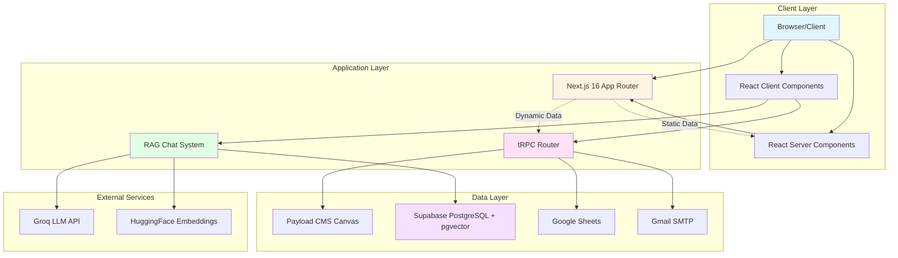
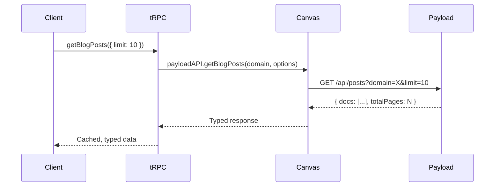
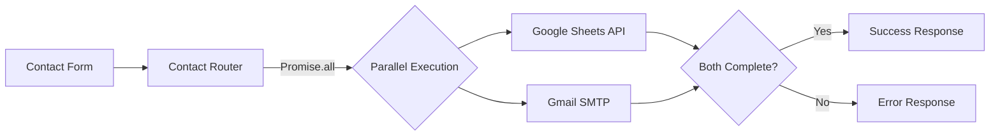
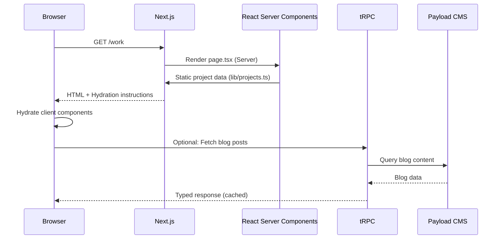
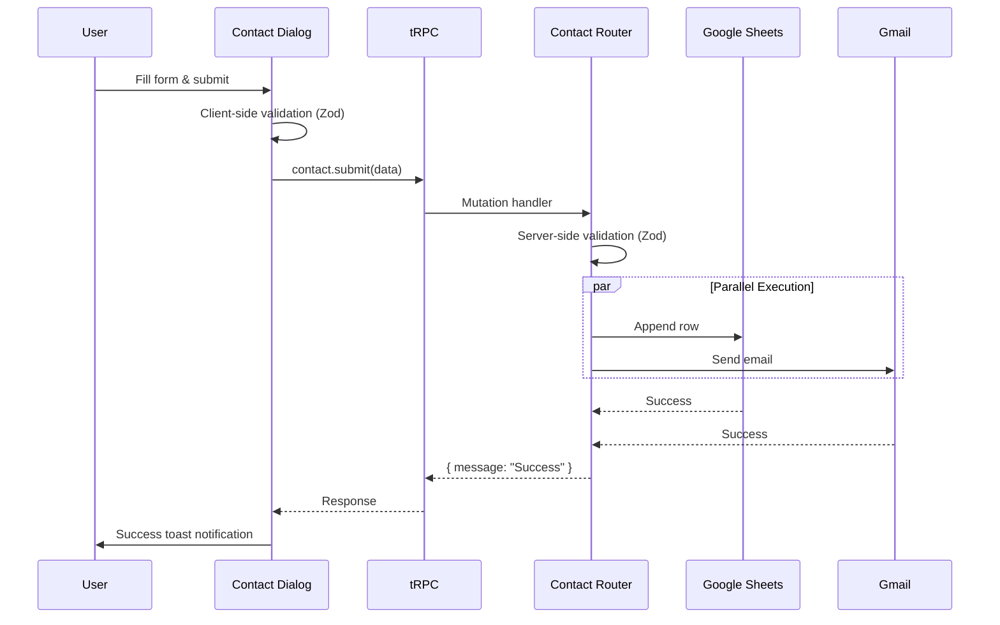
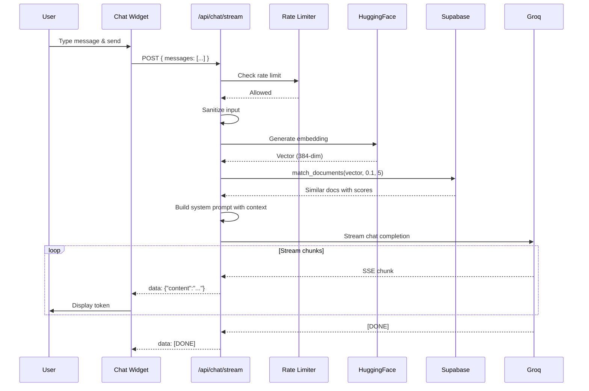
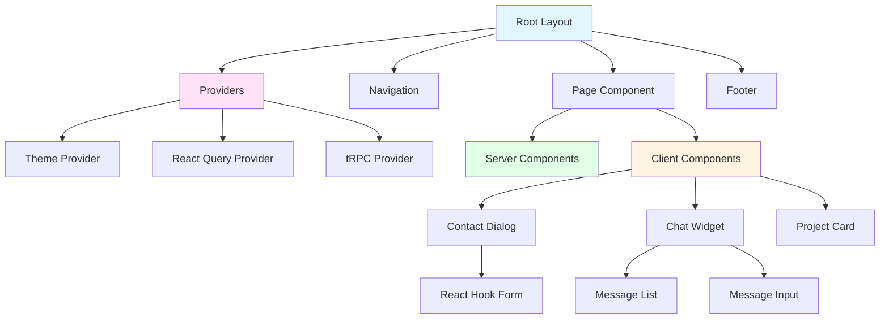
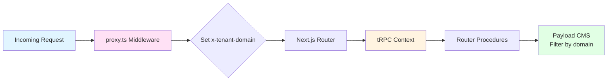
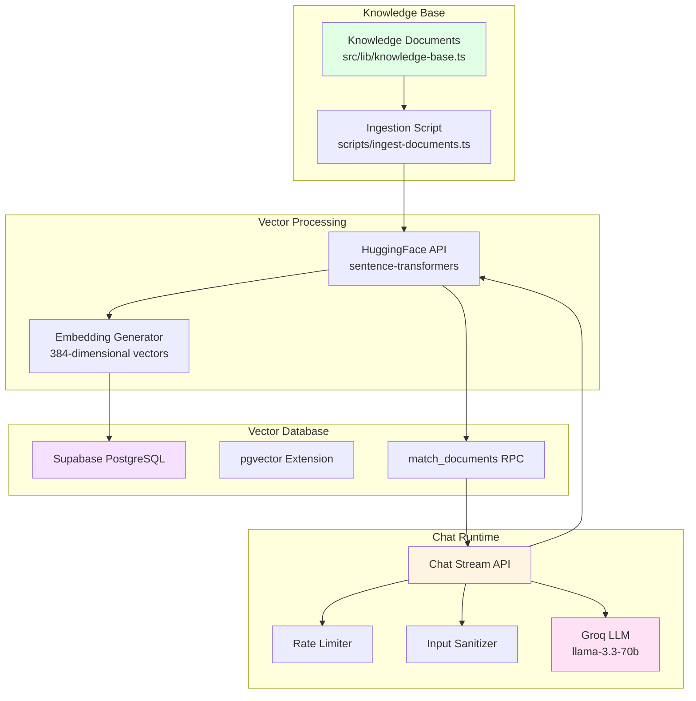
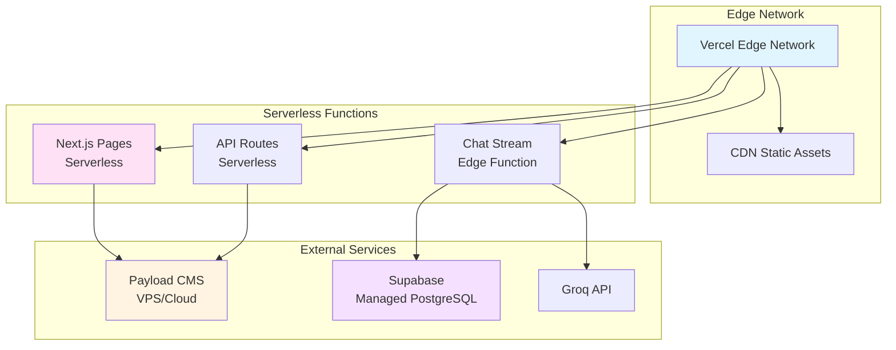

# System Architecture

> Comprehensive architecture documentation for OtherDev Next.js application

## Table of Contents

- [Overview](#overview)
- [High-Level Architecture](#high-level-architecture)
- [Application Layers](#application-layers)
- [Data Flow](#data-flow)
- [Component Architecture](#component-architecture)
- [Multi-Tenant System](#multi-tenant-system)
- [RAG Chat System](#rag-chat-system)
- [Performance Optimizations](#performance-optimizations)

---

## Overview

OtherDev is a modern, full-stack web application built with Next.js 16, leveraging the App Router for file-based routing and React Server Components for optimal performance. The architecture is designed for scalability, type safety, and excellent developer experience.

### Core Principles

- **Type Safety First:** End-to-end TypeScript with tRPC for API layer
- **Performance:** Server Components, React Compiler, code splitting
- **Developer Experience:** Hot reload, auto-imports, full IntelliSense
- **Scalability:** Multi-tenant architecture, vector search, caching
- **Accessibility:** Radix UI primitives, ARIA compliance

---

## High-Level Architecture



---

## Application Layers

### 1. Presentation Layer

**Location:** `src/app/`, `src/components/`

#### Pages (App Router)

```
src/app/
├── layout.tsx                  # Root layout with providers
├── page.tsx                    # Homepage
├── about/page.tsx              # About page
├── work/
│   ├── page.tsx                # Work listing
│   └── [slug]/page.tsx         # Individual project page
└── blog/
    ├── page.tsx                # Blog listing
    └── [slug]/page.tsx         # Individual blog post
```

#### Components

```
src/components/
├── ui/                         # Radix UI primitives (shadcn pattern)
├── navigation.tsx              # Header navigation
├── footer.tsx                  # Footer component
├── project-card.tsx            # Project display card
├── contact-dialog.tsx          # Contact form modal
├── chat-widget.tsx             # RAG AI chat interface
└── providers.tsx               # React Query + tRPC providers
```

**Rendering Strategy:**

- **Server Components (default):** Layout, pages, static content
- **Client Components (`'use client'`):** Interactive components, forms, modals
- **Hybrid:** Server Components wrapping Client Components for optimal performance

---

### 2. API Layer

**Location:** `src/server/`, `src/app/api/`

#### tRPC Routers

```mermaid
graph LR
    Client[Client Code] -->|HTTP POST| Handler[/api/trpc/trpc]
    Handler --> AppRouter[App Router]
    AppRouter --> ContactRouter[Contact Router]
    AppRouter --> ContentRouter[Content Router]

    ContactRouter --> Sheets[Google Sheets]
    ContactRouter --> Gmail[Gmail SMTP]
    ContentRouter --> Payload[Payload CMS]

    style Client fill:#e1f5ff
    style AppRouter fill:#ffe1f5
    style ContactRouter fill:#fff4e1
    style ContentRouter fill:#fff4e1
```

**Directory Structure:**

```
src/server/
├── trpc.ts                     # tRPC initialization & context
├── routers/
│   ├── index.ts                # App router (combines all routers)
│   ├── contact.ts              # Contact form handler
│   └── content.ts              # Blog/CMS content fetcher
└── lib/
    ├── rate-limit.ts           # In-memory rate limiting
    └── rag/
        ├── embeddings.ts       # HuggingFace embedding generation
        └── vector-search.ts    # Supabase pgvector search
```

**Key Features:**

- **SuperJSON Transformer:** Handles Date, Map, Set serialization
- **Type Safety:** Full TypeScript inference from server to client
- **Context Injection:** Domain information from request headers
- **Error Handling:** Automatic HTTP status code mapping

---

### 3. Data Layer

#### 3.1 Content Management (Payload CMS)

**Integration:** Canvas SDK (`@od-canvas/sdk`)

```typescript
// src/lib/payload-api.ts
import { PayloadAPI } from '@od-canvas/sdk';

export const payloadAPI = new PayloadAPI({
  apiUrl: process.env.PAYLOAD_API_URL,
});
```

**Data Flow:**



#### 3.2 Contact Form Data

**Dual Integration:**

1. **Google Sheets:** Long-term storage, backup, manual review
2. **Gmail:** Instant notifications to team



#### 3.3 Vector Database (Supabase)

**Technology:** PostgreSQL with pgvector extension

**Schema:**

```sql
CREATE TABLE documents (
  id UUID PRIMARY KEY DEFAULT gen_random_uuid(),
  content TEXT NOT NULL,
  metadata JSONB,
  embedding vector(384),
  created_at TIMESTAMPTZ DEFAULT NOW()
);

CREATE INDEX ON documents USING ivfflat (embedding vector_cosine_ops);
```

**RPC Function:**

```sql
CREATE OR REPLACE FUNCTION match_documents(
  query_embedding vector(384),
  match_threshold float,
  match_count int
)
RETURNS TABLE (
  id uuid,
  content text,
  metadata jsonb,
  similarity float
)
AS $$
BEGIN
  RETURN QUERY
  SELECT
    documents.id,
    documents.content,
    documents.metadata,
    1 - (documents.embedding <=> query_embedding) AS similarity
  FROM documents
  WHERE 1 - (documents.embedding <=> query_embedding) > match_threshold
  ORDER BY similarity DESC
  LIMIT match_count;
END;
$$ LANGUAGE plpgsql;
```

---

## Data Flow

### Page Load Flow



### Contact Form Submission Flow



### RAG Chat Flow



---

## Component Architecture

### Component Hierarchy



### Design Patterns

#### 1. Container/Presenter Pattern

```typescript
// Container (Client Component with logic)
'use client';

export function ContactDialogContainer() {
  const mutation = trpc.contact.submit.useMutation();
  const form = useForm<ContactFormData>();

  const handleSubmit = async (data: ContactFormData) => {
    await mutation.mutateAsync(data);
  };

  return <ContactDialogPresenter form={form} onSubmit={handleSubmit} />;
}

// Presenter (Pure UI component)
export function ContactDialogPresenter({ form, onSubmit }) {
  return <Form>...</Form>;
}
```

#### 2. Compound Component Pattern

```typescript
// Flexible, composable UI components
<Dialog>
  <DialogTrigger>Open</DialogTrigger>
  <DialogContent>
    <DialogHeader>
      <DialogTitle>Title</DialogTitle>
      <DialogDescription>Description</DialogDescription>
    </DialogHeader>
    <DialogFooter>
      <Button>Close</Button>
    </DialogFooter>
  </DialogContent>
</Dialog>
```

#### 3. Server Component Composition

```typescript
// page.tsx (Server Component)
import { ProjectList } from '@/components/project-list';
import { ContactDialog } from '@/components/contact-dialog';

export default async function WorkPage() {
  // Fetch data on server
  const projects = await getProjects();

  return (
    <main>
      {/* Server Component */}
      <ProjectList projects={projects} />

      {/* Client Component (island) */}
      <ContactDialog />
    </main>
  );
}
```

---

## Multi-Tenant System

### Architecture



### Implementation

**1. Proxy Middleware (`proxy.ts`):**

```typescript
export function middleware(request: NextRequest) {
  const hostname = request.headers.get('host') || 'otherdev.com';

  // Map hostname to tenant identifier
  const domain = getTenantDomain(hostname);

  // Inject into request headers
  request.headers.set('x-tenant-domain', domain);

  return NextResponse.next({ request });
}
```

**2. tRPC Context (`src/server/trpc.ts`):**

```typescript
export const createTRPCContext = async (opts: { req: Request }) => {
  const domain = opts.req.headers.get("x-tenant-domain") || "otherdev.com";
  return { domain };
};
```

**3. Router Usage (`src/server/routers/content.ts`):**

```typescript
export const contentRouter = router({
  getBlogPosts: publicProcedure.query(async ({ ctx }) => {
    // ctx.domain is automatically available
    return await payloadAPI.getBlogPosts(ctx.domain);
  }),
});
```

---

## RAG Chat System

### System Architecture



### Components

#### 1. Knowledge Base

**Location:** `src/lib/knowledge-base.ts`

Structured documents about OtherDev's projects, services, and expertise.

```typescript
export interface KnowledgeDocument {
  content: string;
  metadata: {
    source: string;
    title: string;
    type: 'project' | 'service' | 'team' | 'technology';
    category?: string;
  };
}

export const knowledgeBase: KnowledgeDocument[] = [
  {
    content: "...",
    metadata: {
      source: "website",
      title: "About OtherDev",
      type: "team",
    },
  },
  // More documents...
];
```

#### 2. Embedding Generation

**Model:** `sentence-transformers/all-MiniLM-L6-v2`
**Dimensions:** 384

```typescript
// src/server/lib/rag/embeddings.ts
export async function generateEmbedding(text: string): Promise<number[]> {
  const response = await hf.featureExtraction({
    model: 'sentence-transformers/all-MiniLM-L6-v2',
    inputs: text,
  });
  return response as number[];
}
```

#### 3. Vector Search

**Similarity:** Cosine similarity (1 - cosine distance)

```typescript
// src/server/lib/rag/vector-search.ts
export async function searchSimilarDocuments(
  queryEmbedding: number[],
  matchThreshold: number = 0.1,
  matchCount: number = 5
) {
  const { data, error } = await supabase.rpc('match_documents', {
    query_embedding: queryEmbedding,
    match_threshold: matchThreshold,
    match_count: matchCount,
  });

  return data;
}
```

#### 4. LLM Integration

**Provider:** Groq
**Model:** `llama-3.3-70b-versatile`

```typescript
const completion = await groq.chat.completions.create({
  model: 'llama-3.3-70b-versatile',
  messages: [
    { role: 'system', content: systemPrompt },
    ...userMessages,
  ],
  temperature: 0.7,
  max_tokens: 1024,
  stream: true,
});
```

### Security Measures

1. **Input Sanitization:**
   - Removes prompt injection patterns (`[INST]`, `<|im_start|>`, etc.)
   - Caps message length at 500 characters

2. **Rate Limiting:**
   - 10 requests per minute per IP
   - Sliding window algorithm
   - Returns 429 with `Retry-After` header

3. **Context Isolation:**
   - LLM only sees knowledge base context
   - No access to system prompts or internal data

---

## Performance Optimizations

### 1. React Compiler

**Automatic Optimization:**
- Automatic memoization of components and hooks
- Reduced re-renders without manual `useMemo`/`useCallback`
- Enabled in `next.config.ts`:

```typescript
experimental: {
  reactCompiler: true,
}
```

### 2. Code Splitting

**Automatic via App Router:**
- Each route is a separate bundle
- Dynamic imports for heavy components
- React.lazy for client components

```typescript
import dynamic from 'next/dynamic';

const HeavyComponent = dynamic(() => import('./heavy-component'), {
  loading: () => <Spinner />,
  ssr: false, // Client-side only
});
```

### 3. Image Optimization

**Next.js Image Component:**
- Automatic WebP conversion
- Responsive images with srcSet
- Lazy loading by default
- Remote image patterns configured

```typescript
// next.config.ts
images: {
  remotePatterns: [
    { protocol: 'https', hostname: 'unsplash.com' },
    { protocol: 'https', hostname: 'cdn.jsdelivr.net' },
  ],
}
```

### 4. Caching Strategy

**React Query:**
```typescript
const queryClient = new QueryClient({
  defaultOptions: {
    queries: {
      staleTime: 60 * 1000,      // 1 minute
      cacheTime: 5 * 60 * 1000,  // 5 minutes
      refetchOnWindowFocus: false,
    },
  },
});
```

**tRPC Batching:**
- Multiple requests batched into single HTTP call
- Reduces network overhead

### 5. Server Components

**Benefits:**
- Zero JavaScript sent to client
- Direct database access
- SEO-friendly content
- Faster initial page load

**Usage:**
```typescript
// Server Component (default)
async function ProjectList() {
  const projects = await getProjects(); // Direct data access
  return <div>{projects.map(...)}</div>;
}

// Client Component (opt-in)
'use client';
function InteractiveButton() {
  const [state, setState] = useState();
  return <button onClick={() => setState(...)}>Click</button>;
}
```

---

## Deployment Architecture

### Production Setup



### Environment Configuration

```bash
# Production
NODE_ENV=production
NEXT_PUBLIC_SITE_URL=https://otherdev.com
PAYLOAD_API_URL=https://cms.otherdev.com

# Development
NODE_ENV=development
NEXT_PUBLIC_SITE_URL=http://localhost:3000
PAYLOAD_API_URL=http://localhost:3845
```

---

For more information, see:
- [API Reference](./API_REFERENCE.md) - API documentation
- [Component Library](./COMPONENTS.md) - UI components
- [Developer Guide](./DEVELOPER_GUIDE.md) - Setup and workflow
